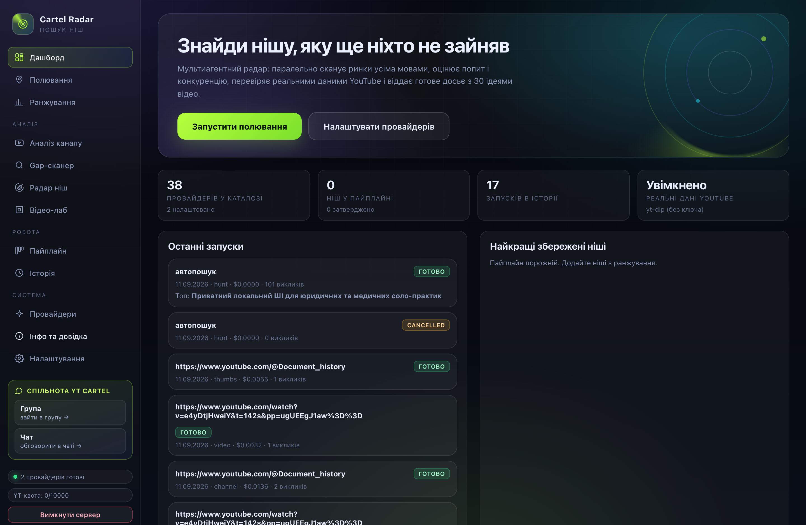
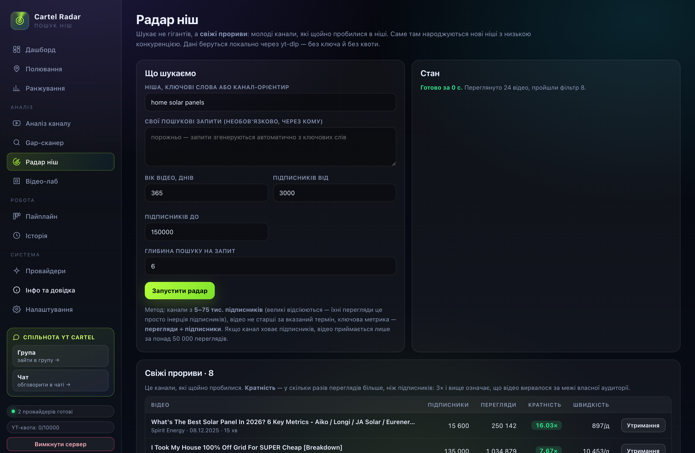
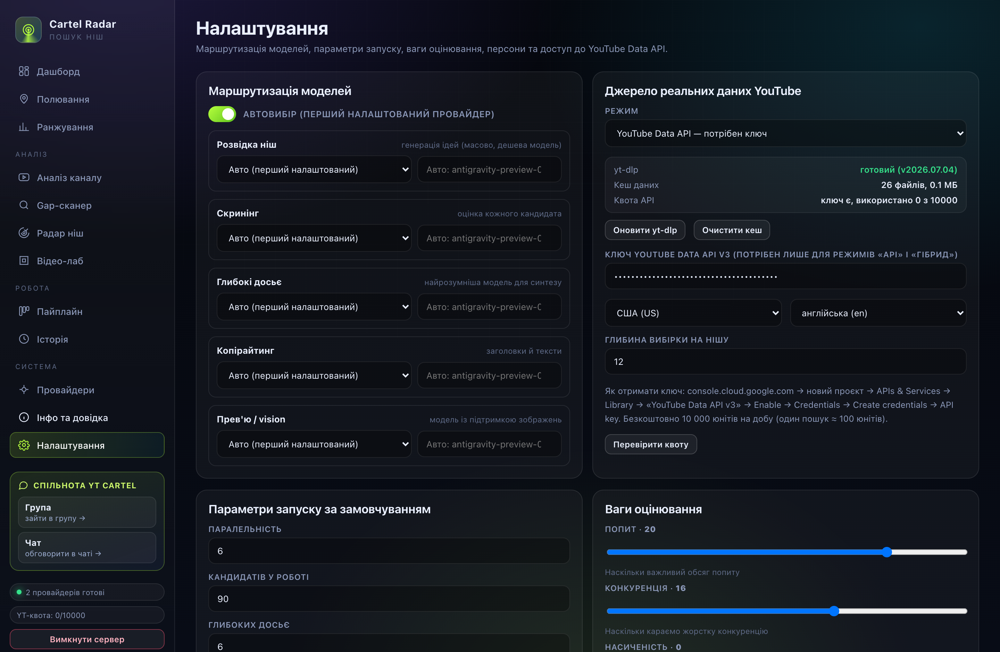

# Cartel Radar

**Знаходить ніші на YouTube, які ще не зайняті.** Не «ідеї для відео» з голови моделі, а ніші, підкріплені реальними цифрами: переглядами, підписниками, швидкістю набору й кривою утримання аудиторії.

Застосунок працює **повністю локально**. Ключі до моделей лежать тільки на вашому комп'ютері й нікуди не надсилаються, окрім запиту до обраного вами провайдера.

[](https://t.me/+e_g6IwDlVhg4OGJi)
[](https://t.me/YT_cartell/242)
[](LICENSE)

---

## Що воно вміє

| Розділ | Що робить |
|---|---|
| **Полювання** | Моделі-агенти шукають ніші за вашими критеріями, паралельно, у кілька потоків. |
| **Ранжування** | Кожна ніша оцінюється за 9 критеріями з вагами: ви бачите не «мені подобається», а число. |
| **Канали** | Розбір конкретного каналу: хіти, провали, швидкість набору, статистика заголовків. |
| **Радар ніш** | Свіжі прориви: молоді канали (5–75 тис. підписників), які щойно вирвалися за межі своєї аудиторії. |
| **Gap-аналіз** | Що в ніші вже знято, а що просять у коментарях, але ніхто не зробив. |
| **Відео-лаб** | Розбір одного відео: темпоритм мовлення, структура, крива утримання, що працює й що ні. |
| **Пайплайн** | Воронка від ідеї до «знімаю»: зібрано → перевірено → затверджено. |
| **Досьє** | Повний документ по ніші: 30 ідей відео, формули заголовків, концепти прев'ю, ризики, план на 30 днів. |
| **Провайдери** | ~38 записів: хмарні (Gemini, OpenAI, Anthropic, DeepSeek, Groq, Mistral, Z.ai, Kimi, Grok) і локальні (Ollama, LM Studio, vLLM). |
| **Інфо** | Детальна довідка просто в застосунку: що за що відповідає, навіщо ключі, які працюють краще. |

---

## Швидкий старт

### macOS

1. Завантажте архів для macOS зі [сторінки релізів](https://github.com/gitkalenyuk/cartel-radar/releases/latest).
2. Розпакуйте й перетягніть **Cartel Radar.app** у папку **Програми**.
3. Перший запуск: клацніть правою кнопкою → **Відкрити** → **Відкрити**.
   Якщо система блокує: **Системні налаштування → Приватність і безпека → Все одно відкрити**.
4. Застосунок відкриється у власному вікні. Далі — розділ **Провайдери**: вставляєте ключ і все.

Потрібен Node.js 18 або новіший: [nodejs.org](https://nodejs.org) (LTS) або `brew install node`.

### Windows

- **Інсталятор:** `Cartel-Radar-Setup-1.0.0.exe` — звичайна установка, ярлик у меню «Пуск».
- **Портативна версія:** `Cartel-Radar-1.0.2-Windows-Portable.zip` — розпакувати будь-куди й запустити `Cartel Radar.bat`. Нічого не встановлюється.

### З вихідного коду (будь-яка система)

```bash
git clone https://github.com/gitkalenyuk/cartel-radar.git
cd cartel-radar
node server.mjs               # відкрийте http://127.0.0.1:8787
node lib/analytics.test.mjs   # 39 перевірок аналітики
```

**Залежностей немає взагалі.** Сервер написаний на чистому Node.js, інтерфейс — на звичайному JavaScript без кроку збірки. Щоб користуватися застосунком, не треба нічого встановлювати через npm.

---

## Звідки беруться дані

Реальні дані YouTube можна брати двома шляхами — і вони поєднуються.

### 1. yt-dlp (рекомендовано)

Локальний інструмент, уже вбудований у застосунок. **Ключ не потрібен, добової квоти немає.**

Що дає: точні дати публікації, перегляди, лайки, коментарі, тривалість, субтитри, коментарі під відео й **криву утримання аудиторії** — ті самі 100 точок, які YouTube показує авторові у студії, причому для чужого каналу теж.

### 2. YouTube Data API

Офіційний шлях. Потрібен ключ із Google Cloud, добова квота — 10 000 юнітів (один пошук ≈ 100 юнітів, тобто близько 100 пошуків на добу).

### Режими в налаштуваннях

| Режим | Що робить |
|---|---|
| **Автоматично** | Якщо є yt-dlp — використовує його; інакше API; якщо немає нічого — працює на самих моделях. |
| **yt-dlp** | Тільки локально, без ключа й квоти. |
| **YouTube API** | Тільки офіційний шлях. |
| **Гібрид** | Спочатку yt-dlp, якщо не вийшло — API. Найнадійніше. |
| **Вимкнено** | Реальних даних немає, працюють лише міркування моделі. |

---

## Навіщо потрібні ключі й які краще

Щоб застосунок думав, потрібна мовна модель. Модель працює на серверах провайдера, тому й потрібен ключ. **Ключ зберігається лише у вас** — у файлі `config.json` з правами доступу `600` (читає тільки власник).

- **Для масового аналізу** (багато ніш, швидко, дешево): DeepSeek, Gemini Flash, Groq, молодші моделі GPT.
- **Для глибоких досьє** (мало, але якісно): Claude, старші GPT, Gemini Pro.
- **Без ключа взагалі:** локальні моделі через Ollama — працюють офлайн, але повільніше й слабше.

Детально — сторінка [Провайдери](docs/providers.html) або розділ **Інфо** всередині застосунку.

---

## Як рахується оцінка ніші

Кожна ніша отримує 0–10 за дев'ятьма критеріями з вагами: попит 20, конкуренція 16, монетизація 14, новизна 12, вічність (evergreen) 10, зростання 8, без обличчя 8, AI-виробництво 6, легкість 6. Ваги можна змінювати під себе; є готові пресети («канал без обличчя», «високий RPM», «для новачка»).

### Кратність до медіани

Головна метрика каналу — не абсолютні перегляди, а те, у скільки разів відео обійшло **медіану свого ж каналу**. Відео з ×3 і вище — справжній викид: воно вирвалося за межі наявної аудиторії. Саме медіана, а не середнє: одне вірусне відео не має спотворювати картину.

Якщо придатних відео менше восьми, застосунок прямо пише, що висновок непевний, і не вдає доказовість.

### Радар свіжих проривів

Фільтр: відео не старше року, канал 5–75 тис. підписників (великі відсіюються — їхні перегляди це просто інерція підписників), ключова метрика — **перегляди ÷ підписники**. Якщо канал ховає підписників, відео приймається лише за понад 50 000 переглядів. Так знаходяться ніші, де ще немає гігантів.

### Дев'ять законів утримання

Усередині кожного досьє — не загальні поради, а правила, за якими будується сценарій:

- **P1. Історія раніше за дані.** Живі персонажі й протиборчі сили з'являються до узагальнень і ведуться крізь усі кризи до фіналу.
- **P2. Винагорода раніше за доведення.** Приголомшливий висновок або парадокс — у перші 60 секунд.
- **P3. Причина й наслідок переплетені.** Жодних подій у хронологічній ізоляції.
- **P4. Дозуй, не вивалюй.** Складність вводиться шарами, а не списком з енциклопедії.
- **P5. Друга складність.** Рівно на середині, коли глядач упевнений, що все зрозумів, вводиться поворот.
- **P6. Конкретика замість абстракції.** Ніяких розмитих прикметників; щонайменше 20–30 вимірюваних чисел на кожні 10 хвилин.
- **P7. Кожна відповідь народжує вище питання.**
- **P8. Фінал змінює картину світу,** а не підсумовує сказане.
- **P9. Жодного жебрацтва.** Нуль прохань про лайки, підписки й дзвіночки.

Пріоритет рішень: утримання > ставки на людині > рання інтелектуальна винагорода > точність фактів > зміна картини світу.

Поряд із методологією застосунок попереджає про **пастку консенсусу**: якщо всі в ніші говорять одне й те саме — це не істина, а кліше.

---

## Куди зберігаються дані

| Система | Тека |
|---|---|
| macOS | `~/Library/Application Support/CartelRadar/data` |
| Windows | `%APPDATA%\CartelRadar\data` |

Там лежать `config.json` (ключі та налаштування, права `600`), `niches.json`, `history.json`, `runs/` і кеш зібраних даних YouTube. Дані **не** лежать усередині застосунку — тому оновлення не стирають ваші ключі. Якщо ви встановлюєте з нуля, застосунок одноразово перенесе дані зі старих тек.

---

## Скріншоти





---

## Часті питання

**Чи потрібен ключ YouTube?**
Ні. Достатньо вбудованого yt-dlp. Ключ YouTube API — альтернатива, якщо хочете офіційний шлях.

**Скільки це коштує?**
Сам застосунок безкоштовний і працює локально. Платите лише провайдеру моделі за токени — типовий сеанс аналізу коштує від кількох центів.

**Мої ключі кудись ідуть?**
Тільки до провайдера, чий ключ ви вставили. Ні до нас, ні до третьої сторони.

**Ключ не працює — що робити?**
Перевірте: ключ скопійовано повністю; у провайдера ввімкнено доступ саме до цієї моделі; на рахунку є кошти; регіон не заблоковано; для reasoning-моделей не стоїть надто малий ліміт виводу. Детальніше — розділ **Інфо** в застосунку.

**Можна без інтернету?**
Можна, якщо використовувати локальні моделі через Ollama. Дані YouTube у такому разі не збиратимуться.

---

## Подяки

Частину ідей для застосунку підкинули люди зі спільноти — і вони вже всередині, а не в списку «колись зробимо».

- **[@Max_ai_work](https://t.me/Max_ai_work)** — за ідеї, з яких виріс застосунок.

Маєте ідею, знайшли нішу або натрапили на помилку — пишіть у [чат спільноти](https://t.me/YT_cartell/242). Найкращі пропозиції потрапляють у наступні версії, і авторство не губиться.

---

## Спільнота

- **Група:** [t.me/+e_g6IwDlVhg4OGJi](https://t.me/+e_g6IwDlVhg4OGJi)
- **Чат:** [t.me/YT_cartell/242](https://t.me/YT_cartell/242)

Питання, знайдені ніші, ідеї та помилки — туди.

---

## English (short version)

**Cartel Radar** is a local-first YouTube niche finder for macOS and Windows. It combines LLM agents with real YouTube data — via bundled `yt-dlp` (no API key, no quota) or the official YouTube Data API, or both. It scores niches on nine weighted criteria, finds breakouts by comparing views to each channel's own median (x-median, true outliers at 3x+), scans for fresh breakouts from small channels, and pulls the official audience-retention curve even for other people's videos. Keys stay on your machine. Zero runtime dependencies: `node server.mjs` and you are done. Docs: [gitkalenyuk.github.io/cartel-radar](https://gitkalenyuk.github.io/cartel-radar/).

---

## Ліцензія

MIT. Робіть що завгодно, тільки не видаляйте згадку про авторство.
